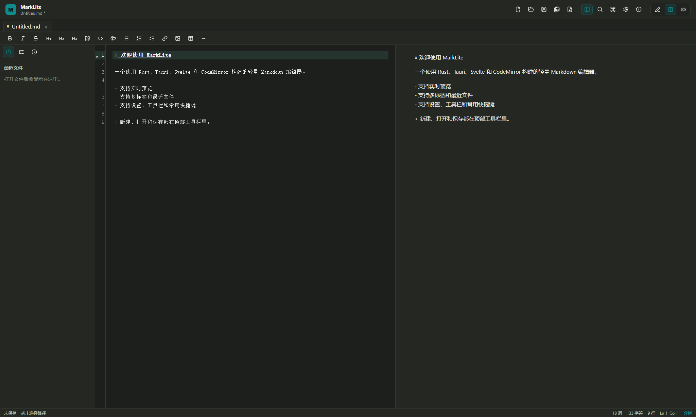

# MarkLite

MarkLite is a lightweight Windows Markdown editor created by **Vazone**. It is built for everyday writing, notes, local Markdown file editing, and live preview. The project uses Rust, Tauri 2, Svelte, TypeScript, CodeMirror 6, and pulldown-cmark to deliver a small, fast, and quiet desktop experience on Windows.



## Download

Download the Windows installer from [MarkLite v0.1.1 Releases](https://github.com/Vazone/Marklite/releases/tag/v0.1.1).

> This is a vibe coding / AI assisted coding open-source project. If any material in this repository unintentionally infringes your rights, please contact Vazone through the GitHub repository. I will review the report and remove or replace the material as soon as possible when appropriate.

## Keywords

Markdown editor, Windows Markdown editor, Rust Markdown editor, Tauri Markdown editor, CodeMirror editor, lightweight notes app, Markdown preview, Windows desktop Markdown, MarkLite, note-taking app, desktop writing app.

## Features

- Create, open, save, and save as `.md`, `.markdown`, and `.txt` files
- Multi-tab editing with dirty state indicators and unsaved-close confirmation
- CodeMirror 6 editor with Markdown highlighting, line numbers, word wrap, active line highlighting, and search
- Markdown toolbar for bold, italic, strikethrough, headings, quote, code block, inline code, lists, task lists, links, images, tables, and horizontal rules
- Rust backend Markdown rendering with pulldown-cmark
- HTML preview sanitization with ammonia to prevent script execution
- Edit, preview, and split-view modes
- Recent files, document outline, and document info sidebar
- Settings for theme, accent color, fonts, font size, line height, line numbers, word wrap, autosave, preview delay, status bar, and sidebar
- Export to HTML
- Drag and drop files into the window
- Windows installer with optional context-menu registration and optional Markdown default-app registration

## Tech Stack

- Rust
- Tauri 2
- Svelte 5
- TypeScript
- Vite
- CodeMirror 6
- pulldown-cmark
- ammonia

## Requirements

Install:

- Node.js 24+
- npm 11+
- Rust stable
- Microsoft Visual Studio Build Tools
- Microsoft Edge WebView2 Runtime

Check the Tauri environment:

```bash
npm run tauri -- info
```

## Install Dependencies

```bash
npm install
```

## Development

```bash
npm run tauri dev
```

Frontend-only preview:

```bash
npm run dev
```

## Build the Windows Installer

Use the project build wrapper:

```bash
npm run package:windows
```

This creates an NSIS installer with MarkLite Windows integration options:

- Add “Open with MarkLite” to the right-click context menu
- Optionally set MarkLite as the default app for `.md` / `.markdown` files
- Release builds no longer open a Windows terminal window

Output:

```text
src-tauri/target/release/bundle/nsis/MarkLite_0.1.1_x64-setup.exe
```

## License

MarkLite is open source under the [MIT License](LICENSE).

## Contributing

Issues and pull requests are welcome. The repository is public, but the main branch should be protected. External changes should go through pull requests and require approval from Vazone before merging.

## Author

Author: Vazone  
Repository: https://github.com/Vazone/Marklite
