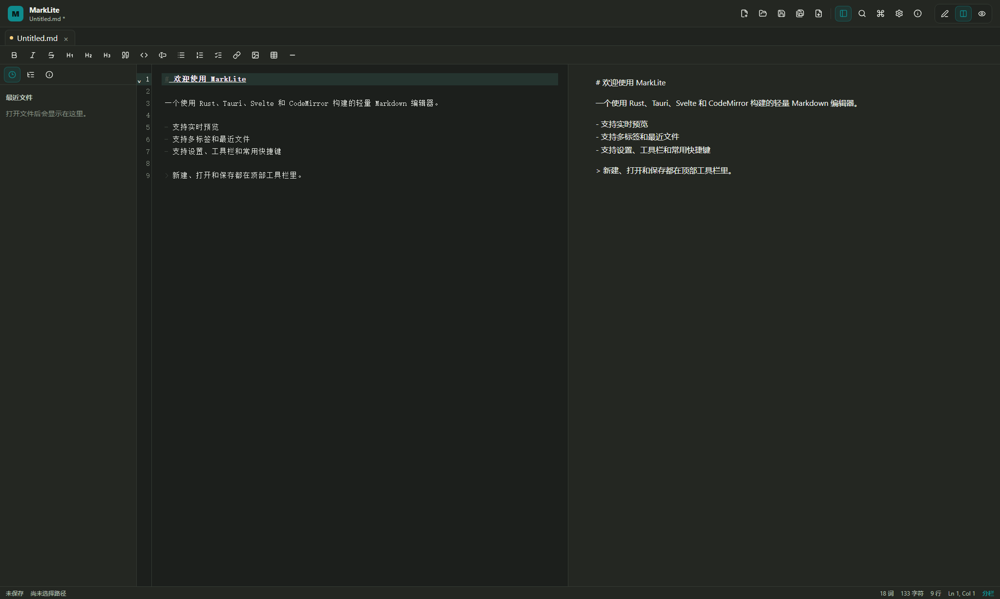

# MarkLite

MarkLite is a lightweight cross-platform Markdown editor created by **Vazone**. It is built for everyday writing, notes, local Markdown file editing, and live preview. The project uses Rust, Tauri 2, Svelte, TypeScript, CodeMirror 6, and pulldown-cmark to deliver a small, fast, and quiet desktop experience on Windows, macOS, and Linux.



## Download

Download Windows x64, macOS Intel/Apple Silicon, or Linux x64 packages from [MarkLite Releases](https://github.com/Vazone/Marklite/releases). Check the release signing notice and `SHA256SUMS.txt` before installation.

> This is a vibe coding / AI assisted coding open-source project. If any material in this repository unintentionally infringes your rights, please contact Vazone through the GitHub repository. I will review the report and remove or replace the material as soon as possible when appropriate.

## Keywords

Markdown editor, cross-platform Markdown editor, Windows Markdown editor, macOS Markdown editor, Linux Markdown editor, Rust Markdown editor, Tauri Markdown editor, CodeMirror editor, lightweight notes app, Markdown preview, MarkLite, note-taking app, desktop writing app.

## Features

- Create, open, save, and save as `.md`, `.markdown`, and `.txt` files
- Multi-tab editing with dirty state indicators, plus save/discard/cancel confirmation before app exit
- CodeMirror 6 editor with Markdown highlighting, line numbers, word wrap, active line highlighting, and search
- Markdown toolbar for bold, italic, strikethrough, headings, quote, code block, inline code, lists, task lists, links, images, tables, and horizontal rules
- Rust backend Markdown rendering with pulldown-cmark
- HTML preview sanitization with ammonia to prevent script execution
- Edit, preview, and split-view modes
- Recent files, document outline, and document info sidebar
- Settings for theme, accent color, fonts, font size, line height, line numbers, word wrap, autosave, preview delay, status bar, and sidebar
- Export to HTML
- Drag and drop files into the window
- GitHub Actions packages Windows x64, Linux x64, macOS Intel, and macOS Apple Silicon releases
- Windows installer includes optional context-menu registration and optional Markdown default-app registration

## Tech Stack

- Rust
- Tauri 2
- Svelte 5
- TypeScript
- Vite
- CodeMirror 6
- pulldown-cmark
- ammonia

## Requirements

Install:

- Node.js 24+
- npm 11+
- Rust 1.88 (pinned by the repository's `rust-toolchain.toml`)
- The platform prerequisites listed by the [Tauri prerequisite guide](https://v2.tauri.app/start/prerequisites/)

Windows development additionally requires Microsoft Visual Studio Build Tools and Microsoft Edge WebView2 Runtime. Linux requires WebKitGTK 4.1 development libraries. macOS builds require Xcode command-line tools.

Check the Tauri environment:

```bash
npm run tauri -- info
```

## Install Dependencies

```bash
npm ci
```

## Development

```bash
npm run tauri dev
```

Frontend-only preview:

```bash
npm run dev
```

## Build and release packages

Use the project build wrapper:

```bash
npm run package:windows
```

This creates an NSIS installer with MarkLite Windows integration options:

- Add “Open with MarkLite” to the right-click context menu
- Optionally set MarkLite as the default app for `.md` / `.markdown` files
- Release builds no longer open a Windows terminal window

Output:

```text
src-tauri/target/release/bundle/nsis/MarkLite_<version>_x64-setup.exe
```

Linux and macOS packages are built on native GitHub-hosted runners when a matching version tag is pushed. The release is published only after all platform jobs succeed; see the [GitHub Actions release workflow](.github/workflows/release.yml).

## License

MarkLite is open source under the [MIT License](LICENSE).

## Contributing

Issues and pull requests are welcome. The repository is public, but the `branch` branch should be protected. External changes should go through pull requests and require approval from Vazone before merging.

## Author

Author: Vazone
Repository: https://github.com/Vazone/Marklite
