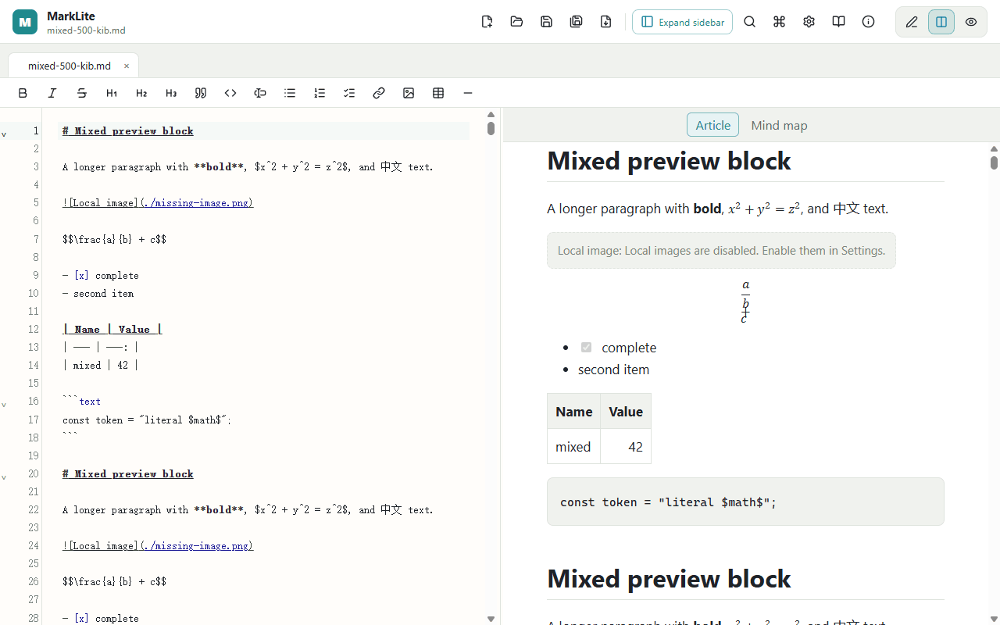

<div align="center">
  
  <h1>MarkLite</h1>
  <p><strong>Fast, focused Markdown editing—without the heavyweight workspace.</strong></p>
  <p>A local-first desktop editor for writing, previewing, organizing, and exporting Markdown on Windows, macOS, and Linux.</p>
  <p>
    <a href="README.zh-CN.md">简体中文</a> ·
    <a href="README.en.md">English</a> ·
    <a href="https://github.com/Vazone/Marklite/releases">Download</a> ·
    <a href="https://github.com/Vazone/Marklite/issues">Issues</a>
  </p>
  <p>
    <a href="https://github.com/Vazone/Marklite/releases"></a>
    <a href="https://github.com/Vazone/Marklite/actions/workflows/ci.yml"></a>
    <a href="LICENSE"></a>
    <a href="https://github.com/Vazone/Marklite/stargazers"></a>
    
  </p>
</div>

<p align="center">
  
</p>
<p align="center"><sub>mixed-500-kib.md (500 KiB): math preview, split-view scrolling and chapter PNG export</sub></p>

## Why MarkLite?

| | |
| --- | --- |
| **⚡ Open and write without waiting**<br>Launch quickly, move between documents smoothly, and stay responsive when Markdown files grow. | **🪶 A calm writing space**<br>No crowded project dashboard—just your documents, writing tools, preview, and the information you need. |
| **✍️ A real writing workspace**<br>CodeMirror 6, multi-tab editing, find and replace, keyboard shortcuts, formatting tools, and recoverable editor state. | **📦 One export workflow**<br>Export the current Markdown snapshot to standalone HTML, PDF, editable DOCX, or export the heading mind map as SVG. |
| **👀 Preview that understands local files**<br>Resizable split view, anchors, local Markdown navigation, controlled local images, and confirmed external links. | **🔒 Local-first by default**<br>Your documents remain ordinary files you control; preview HTML is sanitized before it reaches the interface. |

## Features

### Write and navigate

- Create, open, save, and save as `.md`, `.markdown`, and `.txt` files.
- Edit multiple documents with dirty indicators, horizontal tab scrolling, and browser-style **Close**, **Close Others**, and **Close Tabs to the Right** actions.
- Use Markdown highlighting, line numbers, word wrap, active-line highlighting, folding, search and replace, undo/redo, and configurable indentation.
- Apply headings, emphasis, blockquotes, code, lists, task lists, links, images, tables, and horizontal rules from the toolbar or keyboard.
- Restore per-tab selection, undo history, and scroll position while the application remains open.

### Preview and organize

- Switch between edit, preview, and split layouts, with two-way split scrolling and stable preview positions during rapid wheel input.
- Drag the split separator to resize panes or collapse into a single-pane mode.
- Resize or hide the recent-files sidebar, then restore it without restarting the application.
- Browse recent files, document outline, document statistics, and many open tabs without crowding the editor.
- Follow headings, supported local Markdown/text links, and HTTP/HTTPS links with typed navigation rules.
- Display controlled local PNG, JPEG, GIF, and WebP images when local images are enabled.
- Turn the document heading hierarchy into a color-coded mind map with collapsible branches, drag-to-pan navigation, and jump-to-editor nodes.
- Learn basic, extended, and mind-map syntax from the complete offline guide—no external tutorial required.

### Export and desktop workflow

- Export through one **Export As…** entry to standalone HTML, PDF, editable DOCX, a fully expanded vector mind-map SVG, or chapter-by-chapter PNG images.
- Save one PNG per chapter in a folder beside the source with the same document name; choose a parent folder for unsaved documents.
- Follow actual export stages and chapter/part counts, with cancellation for image exports; CLI and Windows context-menu exports also show progress.
- Large previews load the visible region, while PDF export renders and merges bounded parts to reduce memory pressure.
- Preserve a stable document snapshot even if you keep editing or switch tabs while choosing an export destination.
- Choose light, dark, or system theme; customize accent color, editor typography, preview timing, autosave, sidebar, and status bar.
- Drag supported files into the window or pass them from the operating system.
- Confirm whether to save, discard, or cancel when closing dirty documents or exiting MarkLite.
- On Windows, optionally add **Open with MarkLite** plus `.md` conversion commands for PDF, Word (`.docx`), and HTML from the NSIS installer. On Windows 11 these static commands appear under **Show more options**.

## Download

**MarkLite v0.1.6** · Windows, macOS, and Linux. Packages and release notes are distributed through GitHub Releases.

| Platform | Package |
| --- | --- |
| Windows x64 | [`MarkLite_0.1.6_x64-setup.exe`](https://github.com/Vazone/Marklite/releases/download/v0.1.6/MarkLite_0.1.6_x64-setup.exe) |
| macOS Apple Silicon | [`MarkLite_0.1.6_macos_aarch64.dmg`](https://github.com/Vazone/Marklite/releases/download/v0.1.6/MarkLite_0.1.6_macos_aarch64.dmg) |
| macOS Intel | [`MarkLite_0.1.6_macos_x86_64.dmg`](https://github.com/Vazone/Marklite/releases/download/v0.1.6/MarkLite_0.1.6_macos_x86_64.dmg) |
| Linux x64 AppImage | [`MarkLite_0.1.6_linux_x86_64.AppImage`](https://github.com/Vazone/Marklite/releases/download/v0.1.6/MarkLite_0.1.6_linux_x86_64.AppImage) |
| Linux amd64 Debian | [`MarkLite_0.1.6_linux_amd64.deb`](https://github.com/Vazone/Marklite/releases/download/v0.1.6/MarkLite_0.1.6_linux_amd64.deb) |

Verify downloaded packages with [`SHA256SUMS.txt`](https://github.com/Vazone/Marklite/releases/download/v0.1.6/SHA256SUMS.txt), or read the complete [v0.1.6 release notes](https://github.com/Vazone/Marklite/releases/tag/v0.1.6).

## Technology

| Layer | Technology | Responsibility |
| --- | --- | --- |
| Desktop shell | Rust + Tauri 2 | Native window, file operations, dialogs, lifecycle, and packaging |
| Interface | Svelte 5 + TypeScript | Application state and responsive desktop UI |
| Editor | CodeMirror 6 | Markdown editing, viewport rendering, history, search, and keyboard behavior |
| Markdown | pulldown-cmark + ammonia | Native parsing, outline/statistics generation, and sanitized preview HTML |
| Build | Vite + GitHub Actions | Frontend bundling and Windows/macOS/Linux release packages |

## Build from source

### Requirements

- Node.js 24+
- npm 11+
- Rust 1.88, pinned by `rust-toolchain.toml`
- The system dependencies from the [Tauri prerequisites guide](https://v2.tauri.app/start/prerequisites/)

```bash
git clone https://github.com/Vazone/Marklite.git
cd Marklite
npm ci
npm run tauri dev
```

Frontend-only development:

```bash
npm run dev
```

Core validation:

```bash
npm run check
npm run build
cargo fmt --manifest-path src-tauri/Cargo.toml --all -- --check
cargo test --manifest-path src-tauri/Cargo.toml --locked --all-features
```

Build the verified Windows NSIS package:

```bash
npm run package:windows
```

Platform packages are built with GitHub Actions. Release assets are published after the Windows, Linux, and both macOS architecture builds complete.

## Command-line export

The current source supports single-file HTML, DOCX and native PDF export:

```powershell
.\marklite-cli.exe --help
.\marklite-cli.exe --export "note.md" --format pdf
```

On macOS/Linux use `marklite --export "note.md" --format pdf`. Legacy `export ...` remains supported. Use `--json` for machine-readable output and `--help` for export options. On Windows, keep `marklite-cli.exe` beside `marklite.exe`.

## Contributing

Issues and pull requests are welcome. Include reproduction steps and relevant tests when proposing a change. For sensitive security matters, contact the [maintainer](https://github.com/Vazone) before disclosing details in a public issue.

## License

MarkLite is open source under the [MIT License](LICENSE).

## Author and notice

Created and maintained by [Vazone](https://github.com/Vazone).

MarkLite is an AI-assisted open-source project. If repository material unintentionally infringes your rights, please contact the author through GitHub so it can be reviewed and removed or replaced where appropriate.

<div align="center">
  <strong>If MarkLite makes Markdown feel lighter, consider giving the project a star.</strong><br><br>
  <a href="https://github.com/Vazone/Marklite/stargazers">⭐ Star MarkLite</a>
</div>
