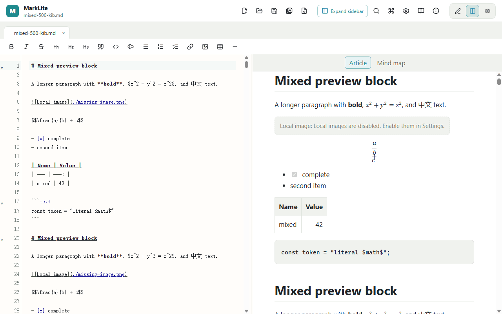

<div align="center">
  
  <h1>MarkLite</h1>
  <p><strong>Fast, focused Markdown editing—without the heavyweight workspace.</strong></p>
  <p>A local-first Markdown editor for Windows, macOS, Linux, and Android: write, organize folders, preview, and export your documents.</p>
  <p>
    <a href="README.zh-CN.md">简体中文</a> ·
    <a href="README.en.md">English</a> ·
    <a href="https://github.com/Vazone/Marklite/releases">Download</a> ·
    <a href="https://github.com/Vazone/Marklite/issues">Issues</a>
  </p>
  <p>
    <a href="https://github.com/Vazone/Marklite/releases">Releases</a> ·
    <a href="https://github.com/Vazone/Marklite/actions/workflows/ci.yml">CI</a> ·
    <a href="https://github.com/Vazone/Marklite/blob/branch/LICENSE">MIT license</a> ·
    <a href="https://github.com/Vazone/Marklite/stargazers">Stars</a> ·
    Windows · macOS · Linux · Android
  </p>
</div>

<p align="center">
  
</p>
<p align="center"><sub>mixed-500-kib.md (500 KiB): math preview, split-view scrolling and chapter PNG export</sub></p>

## What's new in 0.1.7

- **A folder workspace:** reopen your last directory, browse Markdown files in a collapsible tree, filter the list, and reveal a file in the desktop file manager.
- **Android is now available:** open documents from the system file picker or file manager, grant access to a directory, save changes, and export through Android's document provider.
- **More Markdown:** front matter, document tables of contents, footnotes, extended inline syntax, code highlighting, math, and Mermaid improvements.
- **Safer writing:** recovery copies, external-change detection before overwriting, and better handling of recent and restored documents.
- **Optional desktop updates:** background checks notify you of a new version; installation starts after your confirmation.
- **Better DOCX output:** repeated diagrams, footnote images, editable formulas, and links receive export fixes.

## From a folder to a finished document

1. **Choose a directory** to make its Markdown documents available in the sidebar. Your directory selection is remembered across sessions.
2. **Write in the layout you prefer:** editor, live preview, or split view. Open multiple documents and use the outline to navigate headings.
3. **Export when ready:** HTML for sharing, PDF for reading, DOCX for further editing, SVG for a heading mind map, or PNG images by chapter.

| Format | What you get |
| --- | --- |
| HTML | A standalone document with formatted content |
| PDF | A paginated document, assembled from bounded render batches |
| DOCX | An editable document with supported formulas and diagrams |
| PNG | Chapter images grouped in a folder named after the document |
| SVG | A vector mind map generated from document headings |

### Android

The ARM64 APK targets Android 7.0+ (API 24). File and folder access uses the system document picker; Android permissions and storage providers determine which locations are available. Portrait layout respects system bars; landscape provides more writing space. Recent files, directory restoration, touch gestures, and export share the editor's core capabilities.

Desktop application updates and Android APK installation use different mechanisms: the APK is downloaded and installed through Android. An older test build may need to be uninstalled before installing this version; save your documents first.


## Why MarkLite?

| | |
| --- | --- |
| **⚡ Open and write without waiting**<br>Launch quickly, move between documents smoothly, and stay responsive when Markdown files grow. | **🪶 A calm writing space**<br>No crowded project dashboard—just your documents, writing tools, preview, and the information you need. |
| **✍️ A real writing workspace**<br>CodeMirror 6, multi-tab editing, find and replace, keyboard shortcuts, formatting tools, and recoverable editor state. | **📦 One export workflow**<br>Export the current Markdown snapshot to standalone HTML, PDF, editable DOCX, or export the heading mind map as SVG. |
| **👀 Preview that understands local files**<br>Resizable split view, anchors, local Markdown navigation, controlled local images, and confirmed external links. | **🔒 Local-first by default**<br>Your documents remain ordinary files you control; preview HTML is sanitized before it reaches the interface. |

## Features

### Write and navigate

- Create, open, save, and save as `.md`, `.markdown`, and `.txt` files.
- Edit multiple documents with dirty indicators, horizontal tab scrolling, and browser-style **Close**, **Close Others**, and **Close Tabs to the Right** actions.
- Use Markdown highlighting, line numbers, word wrap, active-line highlighting, folding, search and replace, undo/redo, and configurable indentation.
- Apply headings, emphasis, blockquotes, code, lists, task lists, links, images, tables, and horizontal rules from the toolbar or keyboard.
- Restore per-tab selection, undo history, and scroll position while the application remains open.

### Preview and organize

- Switch between edit, preview, and split layouts, with two-way split scrolling and stable preview positions during rapid wheel input.
- Drag the split separator to resize panes or collapse into a single-pane mode.
- Resize or hide the recent-files sidebar, then restore it without restarting the application.
- Browse recent files, document outline, document statistics, and many open tabs without crowding the editor.
- Follow headings, supported local Markdown/text links, and HTTP/HTTPS links with typed navigation rules.
- Display controlled local PNG, JPEG, GIF, and WebP images when local images are enabled.
- Render Mermaid 11.17.2 diagrams offline after installing the optional local ZIP in **Settings → Preview**; diagrams keep their source visible when the pack is missing.
- Turn the document heading hierarchy into a color-coded mind map with collapsible branches, drag-to-pan navigation, and jump-to-editor nodes.
- Learn basic, extended, and mind-map syntax from the complete offline guide—no external tutorial required.

### Export and desktop workflow

- Export through one **Export As…** entry to standalone HTML, PDF, editable DOCX, a fully expanded vector mind-map SVG, or chapter-by-chapter PNG images.
- Save one PNG per chapter in a folder beside the source with the same document name; choose a parent folder for unsaved documents.
- Follow actual export stages and chapter/part counts, with cancellation for image exports; CLI and Windows context-menu exports also show progress.
- Large previews load the visible region, while PDF export renders and merges bounded parts to reduce memory pressure.
- Preserve a stable document snapshot even if you keep editing or switch tabs while choosing an export destination.
- Choose light, dark, or system theme; customize accent color, editor typography, preview timing, autosave, sidebar, and status bar.
- Drag supported files into the window or pass them from the operating system.
- Confirm whether to save, discard, or cancel when closing dirty documents or exiting MarkLite.
- On Windows, optionally add **Open with MarkLite** plus `.md` conversion commands for PDF, Word (`.docx`), and HTML from the NSIS installer. On Windows 11 these static commands appear under **Show more options**.

## Download

**MarkLite v0.1.7** · Windows, macOS, Linux, and Android. Packages and release notes are distributed through GitHub Releases.

| Platform | Package |
| --- | --- |
| Windows x64 | [`MarkLite_0.1.7_x64-setup.exe`](https://github.com/Vazone/Marklite/releases/download/v0.1.7/MarkLite_0.1.7_x64-setup.exe) |
| macOS Apple Silicon | [`MarkLite_0.1.7_macos_aarch64.dmg`](https://github.com/Vazone/Marklite/releases/download/v0.1.7/MarkLite_0.1.7_macos_aarch64.dmg) |
| macOS Intel | [`MarkLite_0.1.7_macos_x86_64.dmg`](https://github.com/Vazone/Marklite/releases/download/v0.1.7/MarkLite_0.1.7_macos_x86_64.dmg) |
| Linux x64 AppImage | [`MarkLite_0.1.7_linux_x86_64.AppImage`](https://github.com/Vazone/Marklite/releases/download/v0.1.7/MarkLite_0.1.7_linux_x86_64.AppImage) |
| Linux amd64 Debian | [`MarkLite_0.1.7_linux_amd64.deb`](https://github.com/Vazone/Marklite/releases/download/v0.1.7/MarkLite_0.1.7_linux_amd64.deb) |
| Android ARM64 | [`MarkLite_0.1.7_android_arm64.apk`](https://github.com/Vazone/Marklite/releases/download/v0.1.7/MarkLite_0.1.7_android_arm64.apk) |

Verify downloaded packages with [`SHA256SUMS.txt`](https://github.com/Vazone/Marklite/releases/download/v0.1.7/SHA256SUMS.txt), or read the complete [v0.1.7 release notes](https://github.com/Vazone/Marklite/releases/tag/v0.1.7).

## Technology

| Layer | Technology | Responsibility |
| --- | --- | --- |
| Desktop shell | Rust + Tauri 2 | Native window, file operations, dialogs, lifecycle, and packaging |
| Interface | Svelte 5 + TypeScript | Application state and responsive desktop UI |
| Editor | CodeMirror 6 | Markdown editing, viewport rendering, history, search, and keyboard behavior |
| Markdown | pulldown-cmark + ammonia | Native parsing, outline/statistics generation, and sanitized preview HTML |
| Build | Vite + GitHub Actions | Frontend bundling and Windows/macOS/Linux release packages |

## Build from source

### Requirements

- Node.js 24+
- npm 11+
- Rust 1.88, pinned by `rust-toolchain.toml`
- The system dependencies from the [Tauri prerequisites guide](https://v2.tauri.app/start/prerequisites/)

```bash
git clone https://github.com/Vazone/Marklite.git
cd Marklite
npm ci
npm run tauri dev
```

Frontend-only development:

```bash
npm run dev
```

For offline Mermaid diagrams in a local desktop build, create the optional pack and select it in **Settings → Preview**:

```bash
npm run build:diagram-pack
```

The pack is written to `src-tauri/target/optional/mermaid-offline-11.17.2.zip`.

Core validation:

```bash
npm run check
npm test
npm run test:tooling
npm run build
npm run build:cli
cargo fmt --manifest-path src-tauri/Cargo.toml --all -- --check
cargo test --manifest-path src-tauri/Cargo.toml --locked --all-features
```

Build the verified Windows NSIS package:

```bash
npm run package:windows
```

CI and Release workflows run only when manually dispatched. Release builds Windows x64, Linux x64, macOS Apple Silicon/Intel, and an ARM64 Android APK.

## Command-line export

The current source supports single-file HTML, DOCX and native PDF export:

```powershell
.\marklite-cli.exe --help
.\marklite-cli.exe --export "note.md" --format pdf
```

On macOS/Linux use `marklite --export "note.md" --format pdf`. Legacy `export ...` remains supported. Use `--json` for machine-readable output and `--help` for export options. On Windows, keep `marklite-cli.exe` beside `marklite.exe`.


### Build Android

Install JDK 17 and the SDK, Build Tools, and NDK versions in [toolchain.json](scripts/android/toolchain.json). Set `JAVA_HOME`, `ANDROID_HOME`, and `NDK_HOME`.

```bash
rustup target add aarch64-linux-android
npm ci
npm run android:build -- --target aarch64 --debug
```

Local test APKs are written to `release/android/arm64/`. Download the APK for installation from the Releases page.

## Contributing

Issues and pull requests are welcome. Include reproduction steps and relevant tests when proposing a change. For sensitive security matters, contact the [maintainer](https://github.com/Vazone) before disclosing details in a public issue.

## License

MarkLite is open source under the [MIT License](LICENSE).

## Author and notice

Created and maintained by [Vazone](https://github.com/Vazone).

If any repository material infringes your rights, please contact the author through GitHub so it can be reviewed and removed or replaced.

<div align="center">
  <strong>If MarkLite makes Markdown feel lighter, consider giving the project a star.</strong><br><br>
  <a href="https://github.com/Vazone/Marklite/stargazers">⭐ Star MarkLite</a>
</div>
