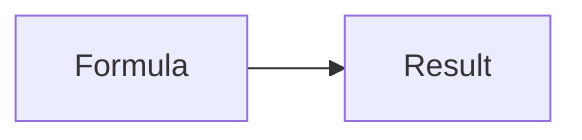

# Formula mapping {#formula}

Inline fraction $\frac{a}{b}$, relation $a\le b$, negation $\neg P$, and alphabet $\mathcal{A}$.

$$
f(x)=\begin{cases}x^2 & x>0 \\ 0 & x\leq0\end{cases}
$$

| Expression | Meaning |
| --- | --- |
| $\sqrt[3]{x}$ | Indexed root |
| $\sum_{i=1}^{n}i$ | Sum |

A reference[^note] and an [external link](https://example.com/?a=1&b=2).

# Matrices and links {#matrices}

[Return to formula](#formula). Repeated reference[^note].

$$
\begin{pmatrix}a & b \\ c & d\end{pmatrix}
$$

$$
\begin{align}a &= b+c \\ d &= e\end{align}
$$

[^note]: **Reference** [web](https://example.com/?a=1&b=2), [mail](mailto:reader@example.com), [formula](#formula), and editable $x^2$.
